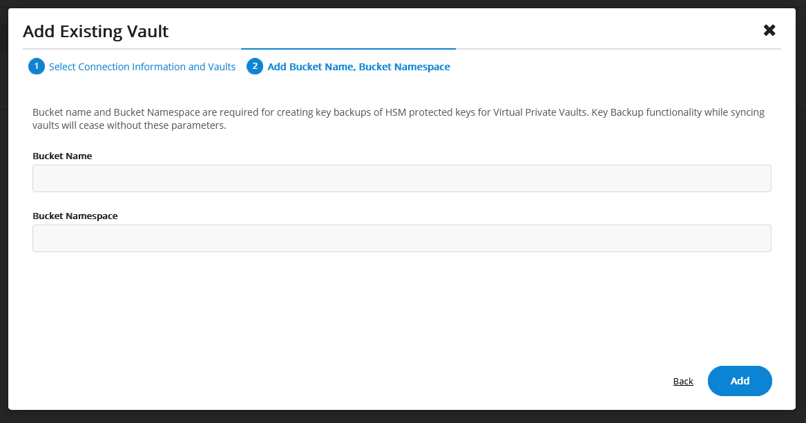
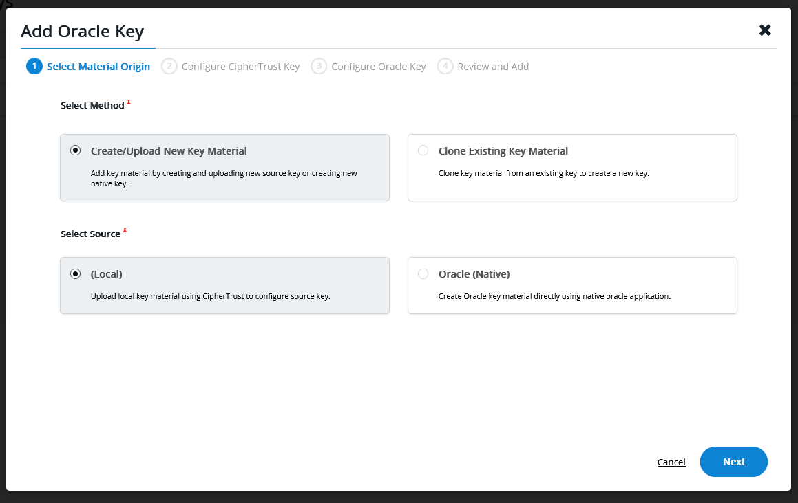
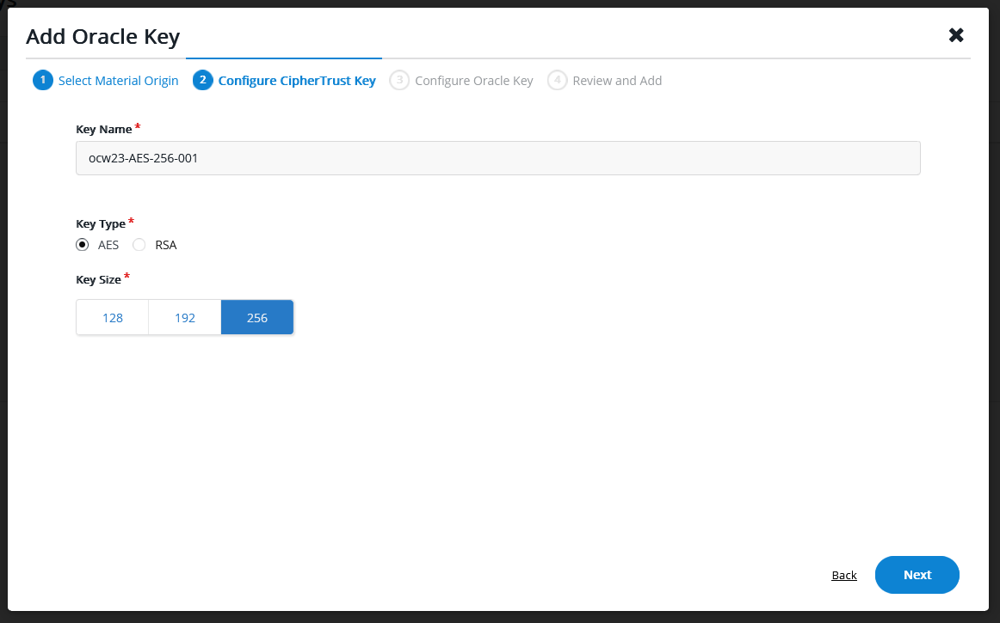
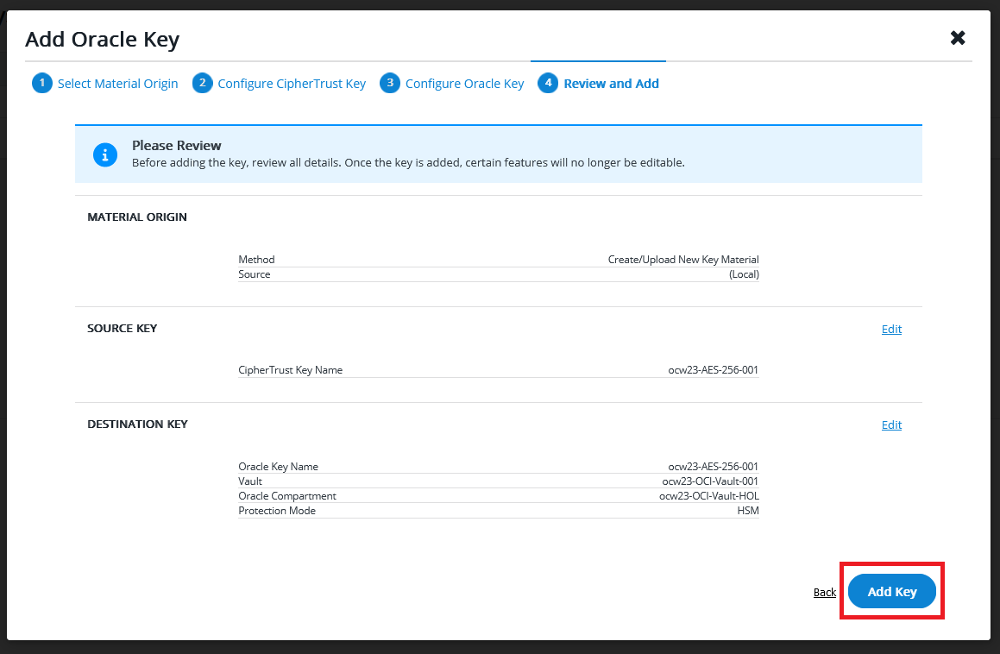
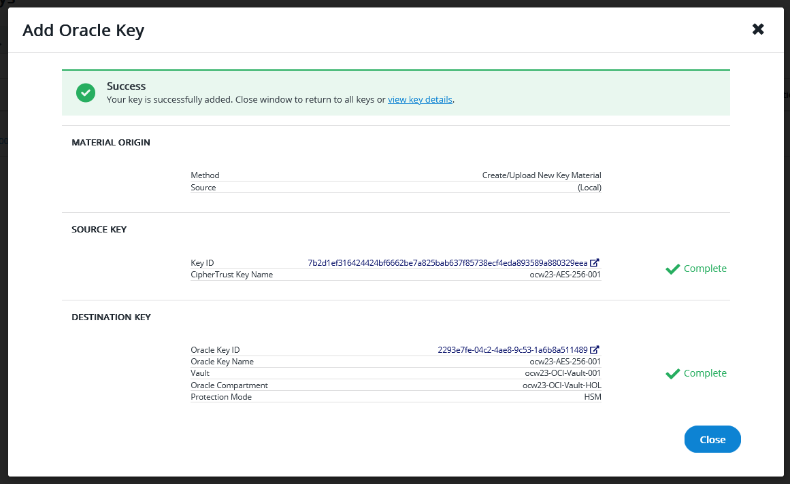

# Lab 2a - Bring Your Own Key to Oracle Cloud Infrastructure (BYOK to OCI)

## Introduction

This lab walks you through how to create your own keys outside of OCI in CTM, and bring them to your OCI tenant in your vault.

Estimated Time: -- minutes

### Objectives

In this lab, you will:
* Add and manage your own Vault from CTM
* Create Encryption keys in CTM and manage them in OCI Vault from CTM

### Prerequisites

This lab assumes you have:
* Access to your OCI and CTM accounts
* All previous labs successfully completed

## Task 1: Managing Oracle Vaults From CTM

1. Open the CipherTrust Manager Web UI and click on the "Cloud Key Manager" tile.

    

2. On the left pane, click Containers and Oracle Vaults. 

    

3. Click "Add Existing Vault".

    

4. Under "Add Existing Vault" configuration, add the following parameters:
    * Oracle connection - select the connection that was previously created, it should be "OCI-Connection_XXX" where "XXX" is your student number.
    * Compartment – Select the compartment "ocwé"-OCI-Vault-HOL".
    * Region - Select your relevant region from the dropdown, it should be the same as in the previous lab.
    * Vault – Select the vault you created earlier, it should be "ocw-OCI-Vault-XXX" where "XXX" is your student number. BE CAREFUL to select your Vault and the one of another student!
    And then click Next. 

    

5. The next step "Add Bucket Name, Bucket Namespace" does not apply to our lab use case so we will skip it, go directly to step 6. 

     

6. click "Add" to add your Vault in your CTM tenant.

     

    You should receive a "Success" message and see you Vault listed in the "Oracle Vaults" pane. Congratulations, now you can remotely manage your Oracle Vault from your CTM tenant. 

## Task 2: Managing Oracle Keys From CTM

1.	On the left pane, click **Cloud Keys > Oracle**.

    

2.	Click on the "Add Key" button. The "Select Material Origin" screen of the "Add Oracle Key" wizard is displayed. Select the key source: in this case we are going to create the key locally on CipherTrust so for "Select Method" click on "Create/Upload New Key Material" and then for "Select Source" click on "(Local)":

    

3. Add Oracle key by providing Key Name, Key Type and Key Size.

     

4. You need to select existing compartment, Vault and protection mode. 

    

5. Click Next.

6. Review the key and click on add key.

     

7. If the key is created successfully, you will see the following screen:

    

8. The key now will appear on the list:

    

9. Now you can go back to the OCI Vault and check whether key created from CTM is visible or not. 

    

10. If you click on your recently created key, and check the key versions for this key, you will be able to see the key details, where the Source of the key is shown as External:

     

This concludes this lab.

## Learn More

*(optional - include links to docs, white papers, blogs, etc)*

* [URL text 1](http://docs.oracle.com)
* [URL text 2](http://docs.oracle.com)

## Acknowledgements
* **Author** - <Name, Title, Group>
* **Contributors** -  <Name, Group> -- optional
* **Last Updated By/Date** - <Name, Month Year>
