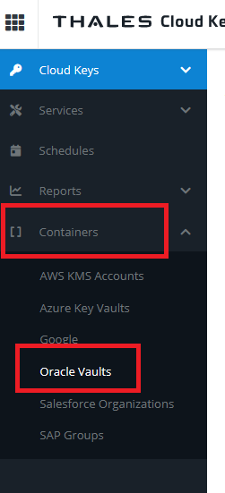
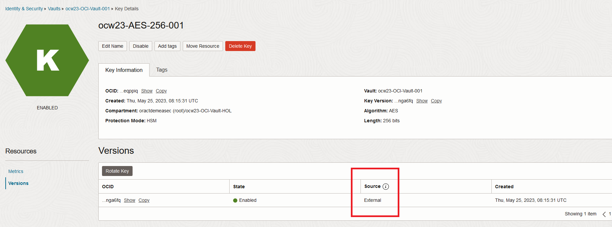

# Lab 3a - Bring Your Own Key to Oracle Cloud Infrastructure (BYOK to OCI)

## Introduction

This lab walks you through the steps to ...

Estimated Time: -- minutes

### About <Product/Technology> (Optional)
Enter background information here about the technology/feature or product used in this lab - no need to repeat what you covered in the introduction. Keep this section fairly concise. If you find yourself needing more than two sections/paragraphs, please utilize the "Learn More" section.

### Objectives

In this lab, you will:
* Bring Your Own Keys to your OCI Vault

### Prerequisites (Optional)

This lab assumes you have:
* An Oracle Cloud account
* All previous labs successfully completed

## Task 1: Managing Oracle Vaults From CTM

1.	Open the CipherTrust Manager Web UI.

    

2. On the left pane, click Containers and Oracle Vaults. 

    

3. Click Add Existing Vault.

    

4. Under Add Existing Key Vault configuration, add the following parameters:
    * Oracle connection - select the connection that was previously created.
    * Compartment – Select the compartment created with Oracle.
    * Region - Select your relevant region from the dropdown.
    * Vault – Select the vault which we created earlier with Oracle.

    

Click Next. 

5. Indeed this configuration does not apply to our lab use case. You can skip it.

     

6. Click Add and add the vault.

     

## Task 2: Managing Oracle Keys From CTM

1.	On the left pane, click **Cloud Keys > Oracle**.

    

2.	Click on Add Key tab. The Select Material Origin screen of the Add Oracle Key wizard is displayed. Select the key source, in this case we are going to create local key on CipherTrust. 

    

3. Add Oracle key by providing Key Name, Key Type and Key Size.

     

4. You need to select existing compartment, Vault and protection mode. 

    

5. Click Next.

6. Review the key and click on add key.

     

7. If the key is created successfully, you will see the following screen:

    

8. The key now will appear on the list:

    

9. Now you can go back to the OCI Vault and check whether key created from CTM is visible or not. 

    

10. If you click on your recently created key, and check the key versions for this key, you will be able to see the key details, where the Source of the key is shown as External:

     

This concludes this lab.

## Learn More

*(optional - include links to docs, white papers, blogs, etc)*

* [URL text 1](http://docs.oracle.com)
* [URL text 2](http://docs.oracle.com)

## Acknowledgements
* **Author** - <Name, Title, Group>
* **Contributors** -  <Name, Group> -- optional
* **Last Updated By/Date** - <Name, Month Year>
