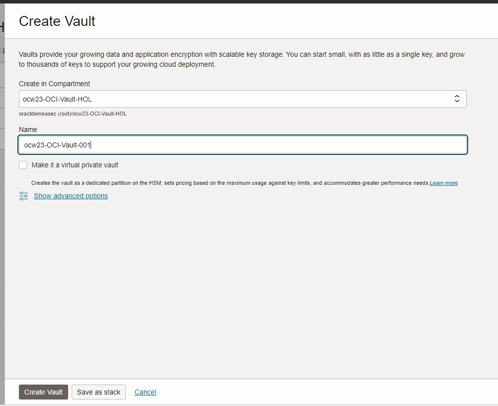
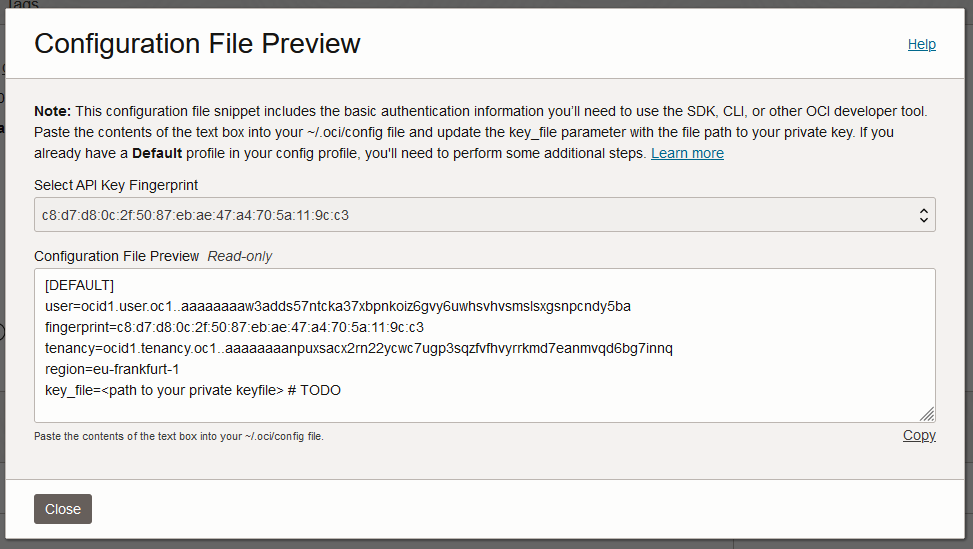

# Lab 1 - Link creation between OCI and your HSM and Master Encryption Key creation

## Introduction

This lab walks you through configuring a connection between the Thales CipherTrust Manager and your Oracle Cloud Infrastructure (OCI) cloud tenant. 

Estimated Time: -- minutes

### Objectives

In this lab, you will:
* Connect to your OCI tenant and create your own Vault in OCI Vault
* Set up a link between Thales CipherTrust Manager and OCI Vault

### Prerequisites

This lab assumes you have:
* An Oracle Cloud account
* All previous labs successfully completed

## Task 1: Connect to OCI and create your own Vault in OCI Vault

You need below parameters to configure OCI connection to integrate with CTM.
* **Tenancy OCID:** OCID of the tenancy.
* **User OCID:** OCID of the user.
* **Region:** An Oracle Cloud Infrastructure region.
* **Fingerprint:** Fingerprint of the public key added to this user.
* **Key File:** Private key file for the OCI connection in the PEM format. Either upload the key file or paste the file content.

You need to create vault in order to store your keys and secrets. There are two types of vaults: Default and Virtual Private. 
* Default vaults share a partition of HSM. 
* Virtual private vault use an isolated partition on a HSM.
Each vault has a management endpoint and a cryptography endpoint. To create a Vault, follow the next steps.

1. Log in to your OCI account by following steps in section Get Started

2. Navigate through the main hamburger menu to *"Identity & Security > Vault"*

	

3. Pick up the compartment in the left menu. Click the display menu and select the already created subcompartment "ocw23-OCI-Vault-HOL". Then click "Create Vault".

    

4. Enter a name for your Vault. Please follow the naming convention: ocw23-OCI-Vault-XXX where XXX is your number student.

     

5. Now your Vault will start to be created. Once it is created, the status will appear as Green and Active in your OCI console:

    

6. In order to configure CTM Oracle connection, you must add an API Key (a RSA key pair) for your user. CTM will use the private key to make connection to OCI and call its API. To do that, click on the top right user profile icon in OCI console and select **User Settings**

    

7. In the menu left, navigate to Resources and API Keys. Click *"Add API Key"*.

    

8. A window will prompt asking you how you want to create those API Keys. You can generate the API key pair direclty in this step, or you also have the option to import previously created keys. In this case, we will generate the API key pair in this step and will download the private key. Then select *"Generate API Key Pair"* and *"Download Private Key"*. Save your private key in a local directory, as you will need it later. Click Add.

    

9. After you click *"Add"*, you will be able to see the Configuration File Preview, as following:

    

Copy all the information on notepad as it will be used to create connection between Oracle and CTM.

## Task 2: Configuring CipherTrust Manager Connection to Oracle

In this task you will create a connection from CipherTrust Manager in Thales platform to Oracle. 

CipherTrust Cloud Key Manager (CTM) solution is part of the Thales CipherTrust Manager. It is designed to address enterprise needs for encrypting data in the cloud while retaining custodianship of encryption keys, to comply with data security mandates in cloud storage environments. The solution uses an already-installed CipherTrust Manager (CM) as the underlying appliance that generates, stores, and retrieves encryption keys used by the CTM servers. The keys and CTM are administered by a Web based graphic interface (Management Console), Command Line Interfaces (CLI) and command-line utilities. The encryption keys are maintained on the Thales CipherTrust Manager Appliance.

CTM is a hardened appliance (Ubuntu) for optimum security and comprises/integrates with MongoDB for secure storage. CipherTrust Cloud Key Manager is delivered as a virtual appliance that can be installed either on-premises (by deploying an .ova file) or on Amazon Web Services (by deploying an Amazon Machine Image (AMI)) or from Azure Marketplace. The features and functionality are the same for both deployment scenarios.

1. Go to the following URL to access CipherTrust Manager as a Service: *"https://us1.ciphertrust.dpondemand.io/?tenant=oracle-OracleCTM"* and append your student number. For example, if your student number is 001, go to the following URL: *"https://us1.ciphertrust.dpondemand.io/?tenant=oracle-OracleCTM001"*

    

2. Enter the credentials you have been provided with. You are now logged into the CipherTrust Manager web console.

    

3. On the left pane, expand Access Management, and then click Connections.

    

4. Click the + Add Connection button to open the Add Connection wizard. The wizard consists of the multiple steps.

    

5. Select Connection Type : Select “Cloud” : “Oracle Cloud Infrastructure”

     

6. General Info: provide a Name and Description (optional) for the new connection.

    

7. After you click **Next**, the step Configure Connection is coming. In this step you have to enter the information you got in your configuration file previously saved, after you created your API key:

    * Tenancy OCID: OCID of the tenancy.
    * User OCID: OCID of the user.
    * Region: An Oracle Cloud Infrastructure region.
    * Fingerprint: Fingerprint of the public key added to this user.
    * Key File: Private key file for the OCI connection in the PEM format. Either upload the key file or paste the file content.
    * File Upload: Select and click Upload Private Key to upload the key file from your machine.
    * Text: Select and paste the certificate content in the text field.
    * Passphrase: Passphrase of the encrypted key file.
    

    

    
    Click Test Connection, a Status: OK message is displayed:

    

8. Click Next. The step is Add Products: Use the check boxes in the Products list to select Cloud Key manager.

    

9. Click Add Connection.

10. From the connection pane you will get an option to test the connection again:

    
    

11. Your connection state should be **Ready.** 

    

## Learn More

### About THALES CipherTrust Manager
CipherTrust Cloud Key Manager (CCKM) solution is part of the Thales CipherTrust Manager. It is designed to address enterprise needs for encrypting data in the cloud while retaining custodianship of encryption keys, to comply with data security mandates in cloud storage environments. The solution uses an already-installed CipherTrust Manager (CM) as the underlying appliance that generates, stores, and retrieves encryption keys used by the CCKM servers. The keys and CCKM are administered by a Webbased graphic interface (Management Console), Command Line Interfaces (CLI) and command-line utilities. The encryption keys are maintained on the Thales CipherTrust Manager Appliance. CipherTrust Cloud Key Manager is delivered as a virtual appliance that can be
installed either on-premises or in the Cloud. The features and functionality are the same
for both deployment scenarios.
In this lab, CipherTrust Manager is hosted outside of Oracle Cloud Infrastructure. The tenant you have been provided with is a Thales Cloud Solution, but the concept would be exactly the same using a CipherTrust Manager instance you are already running in your Company DataCenter for example. In both cases, using a KMS outside of OCI provides greater segregation of duty which answers advanced compliance mandates contained in your company security policy or compliance requirements.

### About OCI Vault
Oracle Cloud Infrastructure Vault is a key management service that stores and manages master
encryption keys and secrets for secure access to resources.
Vault lets you securely store master encryption keys and secrets that you might otherwise store in
configuration files or in code. Specifically, depending on the protection mode, vault keys are either stored on the server or they are stored on highly available and durable hardware security modules (HSM) that meet Federal Information Processing Standards (FIPS) 140-2 Security Level 3 security certification.
The key encryption algorithms that the Vault service supports includes the Advanced Encryption Standard (AES), the Rivest-Shamir-Adleman (RSA) algorithm, and the elliptic curve digital signature algorithm (ECDSA). You can create and use AES symmetric keys and RSA asymmetric keys for encryption and decryption. You can also use RSA or ECDSA asymmetric keys for signing digital messages.
You can use the Vault service to create and manage the following resources:
 Vaults
 Keys
 Secrets

## Acknowledgements
* **Author** - <Name, Title, Group>
* **Contributors** -  <Name, Group> -- optional
* **Last Updated By/Date** - <Name, Month Year>

