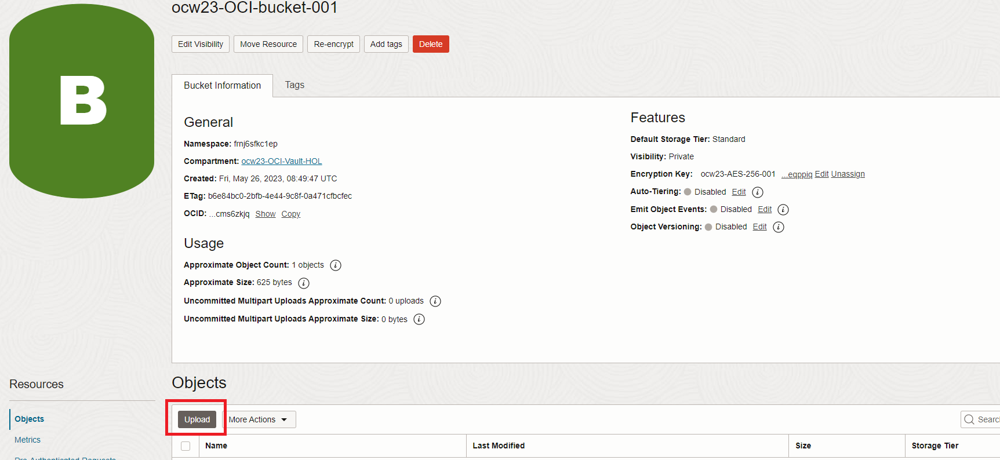
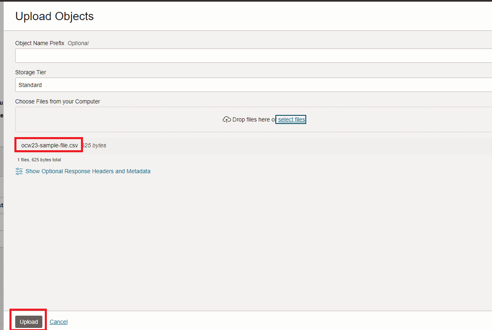
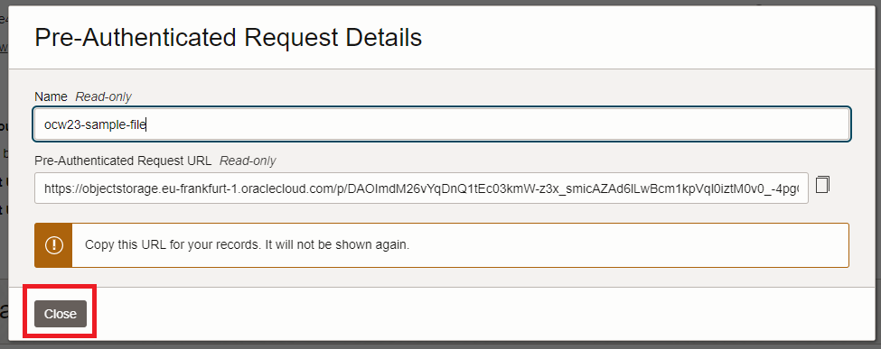
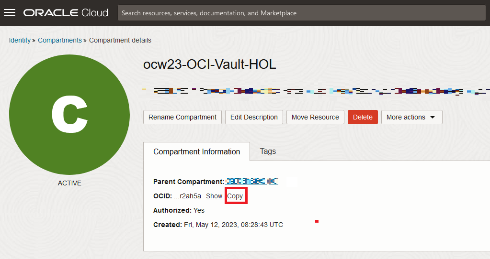
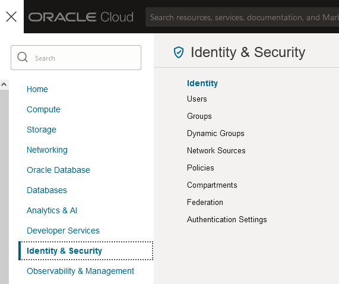
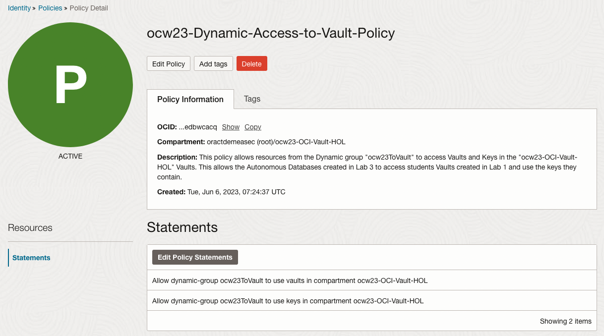
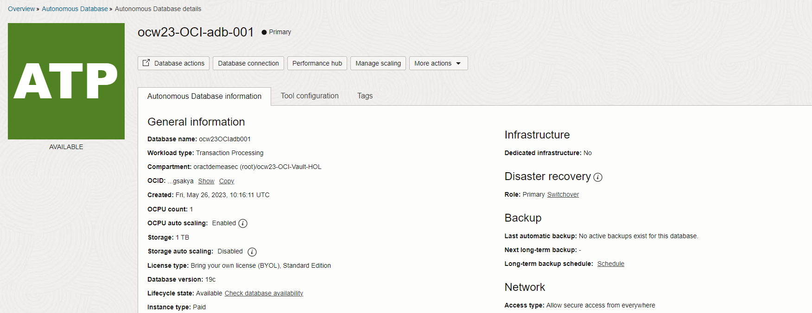
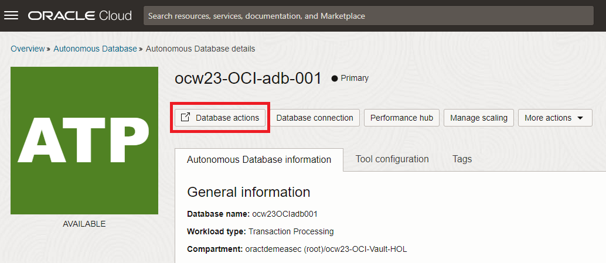
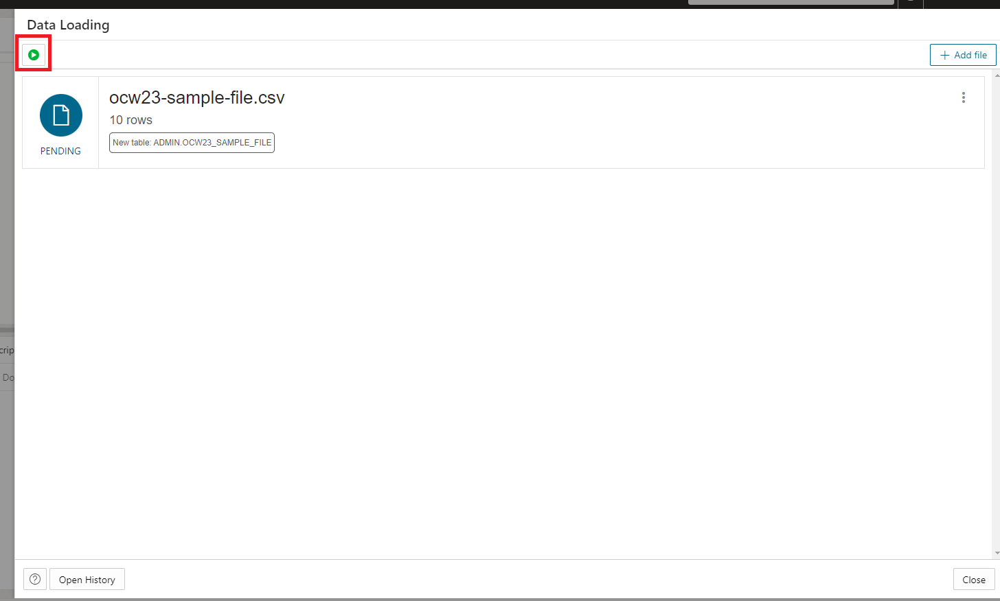
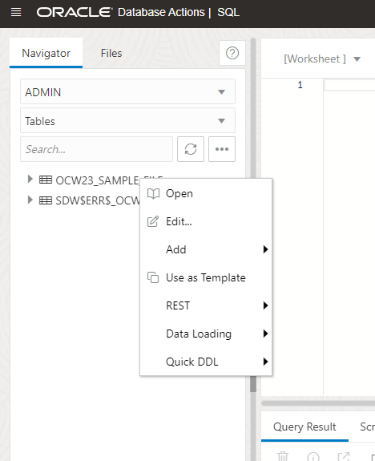

# Lab 3 - Configure OCI resources encryption with an externally managed key

### Introduction

This lab walks you through the creation of different OCI resources and the configuration of their encryption with the key you created externally to OCI in Thales CipherTrust Manager. 

You are your Company Data Manager. You will create a storage space as well as an Autonomous Database. You will select to encrypt those resources with the key you created in Thales CipherTrust Manager during the previous lab. You will upload data to those two resources and access it to make sure the encryption/decryption operations are working correctly. 

Estimated Lab Time: -- minutes

### Objectives

In this lab, you will:
* Connect to your OCI tenant and create an encrypted Storage Bucket and Autonomous Database.
* Test access to the encrypted data and confirm the right users can correctly access cleartext data in the Storage Bucket and Autonomous Database.

## Task 1: Create a bucket with your own encryption keys

1. You first need to login to your OCI tenant with the Data_Manager_XXX user where XXX is your student login, please refer to the "Get Started" Lab if required. 
Let's first create a bucket in OCI Object Storage. To do that, log in to OCI console and navigate through the main hamburger menu to *"Storage > Object Storage > Buckets"*.
 
    

2. Create a bucket in the compartment "ocw23-OCI-Vault-HOL" by selecting the compartment on the left in the dropdown list, then by by clicking the **Create Bucket** button.
    
    


3. Name it by following this naming convention: 
* **"ocw23-OCI-bucket-XXX"** where "XXX" is your student number. 

Select the option **Encrypt using customer-managed keys**. Once you select that option, new fields to be filled will appear.
* Select the Vault you created in lab 1 called "ocw23-OCI-Vault-XXX" where "XXX" is your student number. 
* Select the encryption key that you created in Thales CTM, called "ocw23-AES-256-XXX" where "XXX" is your student number.

Then click **Create**.
    

4. Congratulations, you have now created a new storage bucket in OCI where all the data you upload will be automatically encrypted at all times with the encryption key you created on Thales CTM:

  

## Task 2: Upload data into the bucket and check visibility

You will upload a file that will be provided to you into the bucket you recently created in Object Storage.

1. Donwload the file [ocw23-sample-file.csv](https://objectstorage.eu-frankfurt-1.oraclecloud.com/p/4B-I7ermCb2D5OfuLn9XyvSCaEI9knzz35jIcQEnkinsuFOfg94HtJnuimhWjISj/n/frnj6sfkc1ep/b/ocw23-resources/o/ocw23-sample-file.csv)

2. Click in your recently created bucket and click **Upload** in the section **Objects**:

  

3. Leave the Object prefix name blank and select the file you downloaded. Click **Upload**:

   

4. Close the window, and now you can see your file uploaded into your bucket under section **Objects**:

  

5. Now you will create a pre-authenticated request to be able to access the file in a specified time. You could share as well this URL with others. To do that, click to **Pre-Authenticated Requests** in the menu Resources in the left:

  

6. Click **Create Pre-Authenticated Request**:

  

7. Fill the parameters as follow 
* Name: enter "ocw23-sample-file"
* Pre-Authenticated Request target: Click on the "Object" tile
* Object Name: enter "ocw23-sample-file.csv"
* Access Type: select "Permit object reads"
* Expiration: leave the default or choose any time. 

 Then click **Create Pre-Authenticated Request**:
  

8. A window will prompt with the URL of the pre-authenticated request. Copy this URL and save it locally, you will need it later in lab 4. Click **Close**.

  

9. To check you have visibility into the file in your bucket, open another browser and go to the URL you copied previoulsy. The file should be automatically downloaded and you will be able to open it with Microsoft Excel and look at the content : it's decrypted. A job well done!

## Task 3: Create an Autonomous Database with your own encryption keys

Let's create now the Autonomous Database.
In order to use customer-managed encryption for Autonomous Database, it is needed to create permissions to allow OCI Vault service to communicate with your Autonomoous Database. To do that, you need first to create a dynamic group and policies to provide access to the vault and keys for Autonomous Database instance. 

1. Create a dynamic group to make the master encryption key accessible to the Autonomous Database instance: in the Oracle Cloud Infrastructure console click *"Identity & Security"* and under *"Identity"*, click *"Dynamic Groups"*. 

 

2. Click Create Dynamic Group

  

3. Enter a name and a description for the Dynamic Group: 
* "ocw23-OCI-Vault-ADW-access-XXX" where "XXX" is you student number. 

Regarding the rule, when you are creating the dynamic group before you provision or clone an Autonomous Database instance, the OCID for the new database is not yet available. For this case, create a dynamic group that specifies the resources in a given compartment by writting the following rule:

  ```
  resource.compartment.id = '<your_Compartment_OCID>'
  ```
  where &lt;your\_Compartment\_OCID&gt; is the OCID of the compartment ocw23-OCI-Vault-HOL.

  To find out this OCID, open a new tab and keep in OCI console. In the OCI console click *"Identity & Security"* and under *"Identity"*, click *"Compartments"*. Then click on your compartment ocw23-OCI-Vault-HOL and click the link Copy next to the OCID:
    

  Once you have your compartment OCID, you will be able to add it in the rule associated to the dynamic group you are about to create. The window with dynamic group information will look like as the image below:
    

4. Write policy statements for the dynamic group to enable access to OCI resources (vaults and keys). To do that, in the OCI console click *"Identity & Security"* and under *"Identity"*, click *"Policies"*:

  


5. To write policies for a dynamic group, click Create Policy, and enter a Name and a Description. Use the Policy Builder to create a policy for vault and keys in the local tenancy.

  ```
  Allow dynamic-group ocw23-OCI-Vault-XXX to use vaults in compartment ocw23-OCI-Vault-HOL
  Allow dynamic-group ocw23-OCI-Vault-XXX to use keys in compartment ocw23-OCI-Vault-HOL
  ```
  It will look like something similar to:

   

6. Click Create to save the policy.

7. Now you can create the Autonomous Database. Navigate through the main hamburger menu to: *"Oracle Database > Autonomous Database"*.

    


8.	Click Create Autonomous Database:

    


9.	Fill the parameters as follows:
    * Compartment: ocw23-OCI-Vault-HOL
    *	Display Name: ocw23-OCI-adb-001
    *	Database Name: ocw23OCIadb001
    *	Workload type: Transaction Processing
    *	Deployment type: Shared Infrastructure
    *	Configure the database: &lt;Leave it as default&gt; 
    *	Administrator credentials: &lt;your ADMIN password&gt; 
    *	Network access: Secure access from everywhere
    *	License type: Bring Your Own License (BYOL)
    * Oracle Database Edition: Oracle Database Standard Edition (SE)
  
  Click the link *"Show advanced options"*. A new section for Encryption Key will appear. Select the option: *"Encrypt using a customer-managed key in this tenancy"* and enter your previously created Vault and Master Encryption Key.

    


10. Click **Create Autonomous Database**. Then wait until the database status is set to green and ACTIVE.

  

## Task 4: Upload data into the Autonomous Database and check visibility

In this task you will load the previous CSV file you loaded into your bucket, into your previously created Autonomous Database.

1. Navigate to your Autonomous Database page in OCI console and go to the Database Actions Launchpad:

  

2. Once there, click to SQL under Development:

  

3. Web SQL Development UI is open and now you can load data into your database by clicking to **Data Load** on the top corner right:

  

4. Drag and drop the file into the prompted window and click the button **Run all**, which is shown as the green button icon on the top-left corner:

  

5. When the upload is complete, you will be able to see the state **Uploaded** next to the file. Click **Close**:

   

6. Refresh the browser and you will be able to see the new created table:

  

7. In order to see the data into the table, right click to the table and click **Open**:

  

8. In the new window, click the tab Data:

  

This concludes this lab.

## Learn More

*(optional - include links to docs, white papers, blogs, etc)*

* [URL text 1](http://docs.oracle.com)
* [URL text 2](http://docs.oracle.com)

## Acknowledgements
* **Author** - <Name, Title, Group>
* **Contributors** -  <Name, Group> -- optional
* **Last Updated By/Date** - <Name, Month Year>
