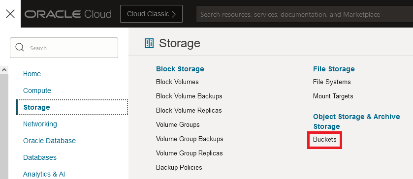
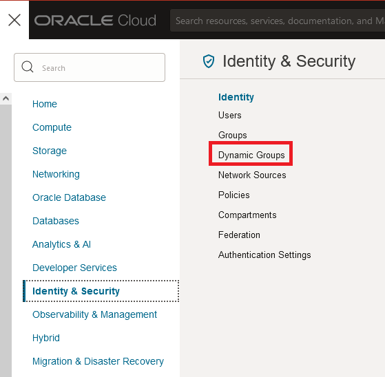
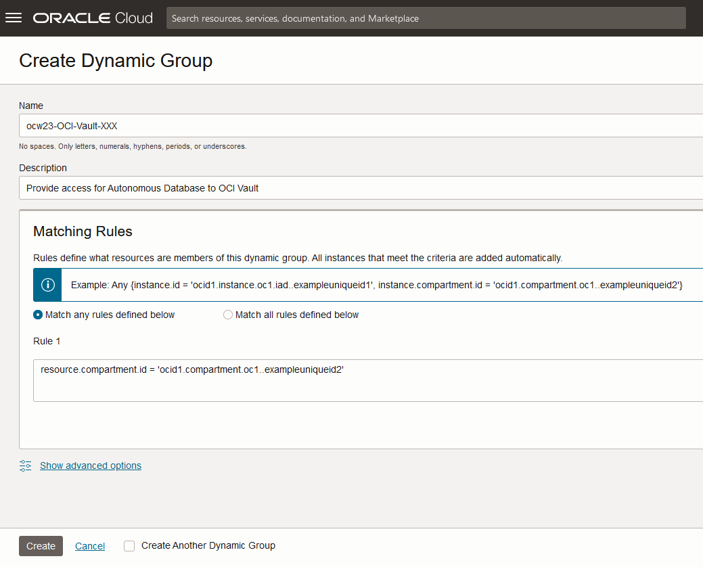
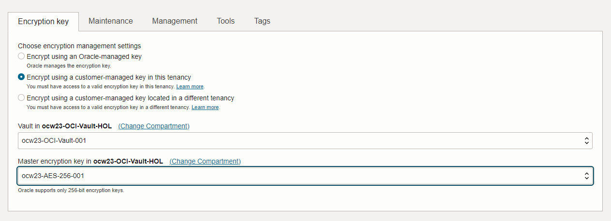
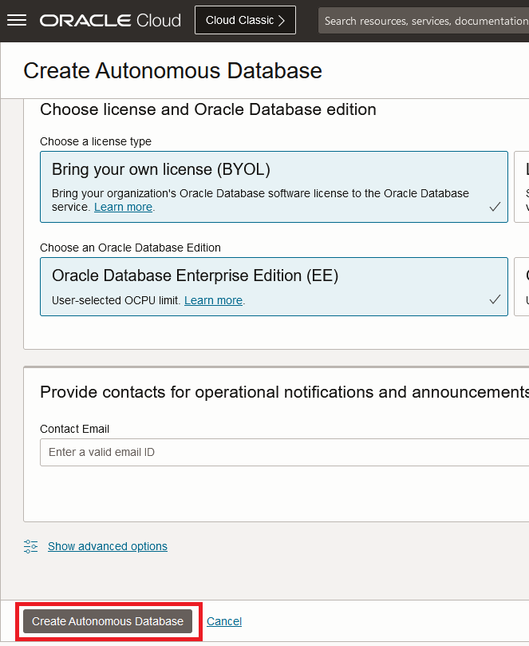

# Lab 4 - Configure customer managed encryption for OCI resources

## Introduction

*Describe the lab in one or two sentences, for example:* This lab walks you through the steps to ...

Estimated Lab Time: -- minutes

### About <Product/Technology> (Optional)
Enter background information here about the technology/feature or product used in this lab - no need to repeat what you covered in the introduction. Keep this section fairly concise. If you find yourself needing more than two sections/paragraphs, please utilize the "Learn More" section.

### Objectives

*List objectives for this lab using the format below*

In this lab, you will:
* Connect to your OCI tenant and create an encrypted Storage Bucket and Autonomous Database.
* Test access to the encrypted data and confirm the right users can correctly access cleartext data in the Storage Bucket and Autonomous Database.


### Prerequisites (Optional)

*List the prerequisites for this lab using the format below. Fill in whatever knowledge, accounts, etc. is necessary to complete the lab. Do NOT list each previous lab as a prerequisite.*

This lab assumes you have:
* An Oracle Cloud account
* All previous labs successfully completed


*This is the "fold" - below items are collapsed by default*

## Task 1: Create OCI resources with your own encryption keys

1. Let's first create a bucket in OCI Object Storage. To do that, log in to OCI console and navigate through the main hamburger menu to *"Storage > Object Storage > Buckets"*.
    
    

2. Create a bucket in the compartment we used to create the Vault by selecting the compartment and clicking Create Bucket.
    
    


3. Name it by following same name convention as before. Select the option Encrypt using customer-managed keys. Once you select that option, new ields to be filled will appear. Select the previously created Vault and the encryption keys that you stored in this Vault. Then click Create.
    

4. Now you have already created your bucket with your own ecnryption keys. Let's create now the Autonomous Database.
In order to use customer-managed encryption for Autonomous Database, it is needed to create permissions to allow OCI Vault service to communicate with your Autonomoous Database. To do that, you need first to create a dynamic group and policies to provide access to the vault and keys for Autonomous Database instance. 

5. Create a dynamic group to make the master encryption key accessible to the Autonomous Database instance: in the Oracle Cloud Infrastructure console click *"Identity & Security"* and under *"Identity"*, click *"Dynamic Groups"*. 

 

6. Click Create Dynamic Group

  

7. Enter a name and a description for the Dynamic Group. Regarding the rule, when you are creating the dynamic group before you provision or clone an Autonomous Database instance, the OCID for the new database is not yet available. For this case, create a dynamic group that specifies the resources in a given compartment by writting the following rule:

    ```
    resource.compartment.id = '<your_Compartment_OCID>'
    ```
  where &lt;your\_Compartment\_OCID&gt; is the OCID of the compartment ocw23-OCI-Vault-HOL.

  To find out this OCID, open a new tab and keep in OCI console. In the OCI console click *"Identity & Security"* and under *"Identity"*, click *"Compartments"*. Then click on your compartment ocw23-OCI-Vault-HOL and click the link Copy next to the OCID:

    

  Once you have your compartment OCID, you will be able to add it in the rule associated to the dynamic group you are about to create. The window with dynamic group information will look like as the image below:

    

8. Write policy statements for the dynamic group to enable access to OCI resources (vaults and keys). To do that, in the OCI console click *"Identity & Security"* and under *"Identity"*, click *"Policies"*:

  


9. To write policies for a dynamic group, click Create Policy, and enter a Name and a Description. Use the Policy Builder to create a policy for vault and keys in the local tenancy.

  ```
  Allow dynamic-group ocw23-OCI-Vault-XXX to use vaults in compartment ocw23-OCI-Vault-HOL
  ```
  It will look like something similar to:

   

10. Click Create to save the policy.

11. Now you can create the Autonomous Database. Navigate through the main hamburger menu to: *"Oracle Database > Autonomous Database"*.

    


6.	Click Create Autonomous Database:

    


7.	Fill the parameters as follows:
    * Compartment: ocw23-OCI-Vault-HOL
    *	Display Name: ocw23XXX
    *	Database Name: ocw23XXX
    *	Workload type: Transaction Processing
    *	Deployment type: Shared Infrastructure
    *	Configure the database: &lt;Leave it as default&gt; 
    *	Administrator credentials: &lt;your ADMIN password&gt; 
    *	Network access: Secure access from everywhere
    *	License type: Bring Your Own License (BYOL)
    * Oracle Database Edition: Oracle Database Standard Edition (SE)
  
  Click the link *"Show advanced options"*. A new section for Encryption Key will appear. Select the option: *"Encrypt using a customer-managed key in this tenancy"* and enter your previously created Vault and Master Encryption Key.

    


8. Click Create Autonomous Database. Then wait until the database status is set to green and ACTIVE.

  


## Learn More

*(optional - include links to docs, white papers, blogs, etc)*

* [URL text 1](http://docs.oracle.com)
* [URL text 2](http://docs.oracle.com)

## Acknowledgements
* **Author** - <Name, Title, Group>
* **Contributors** -  <Name, Group> -- optional
* **Last Updated By/Date** - <Name, Month Year>
