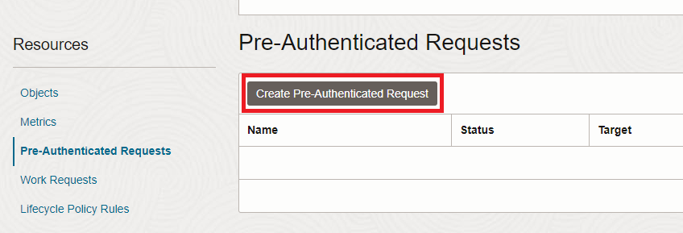
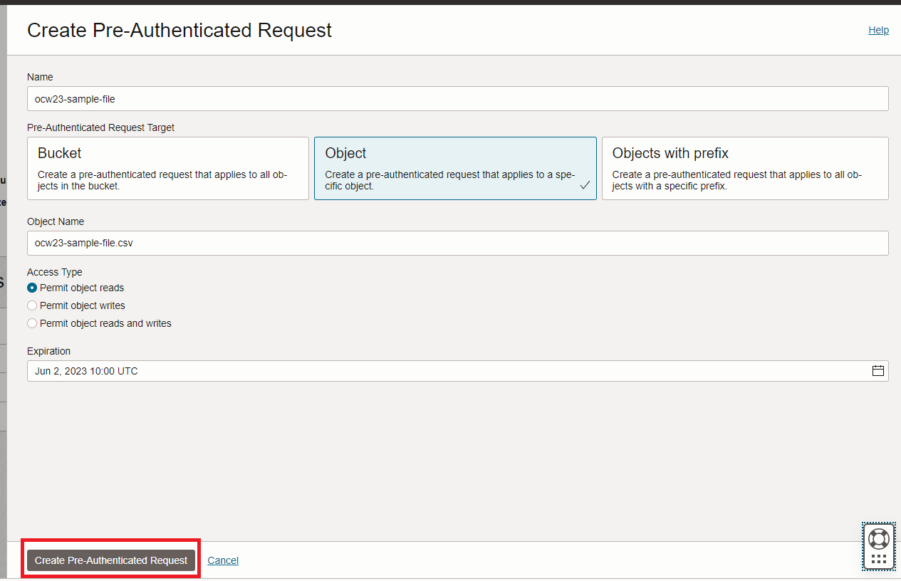
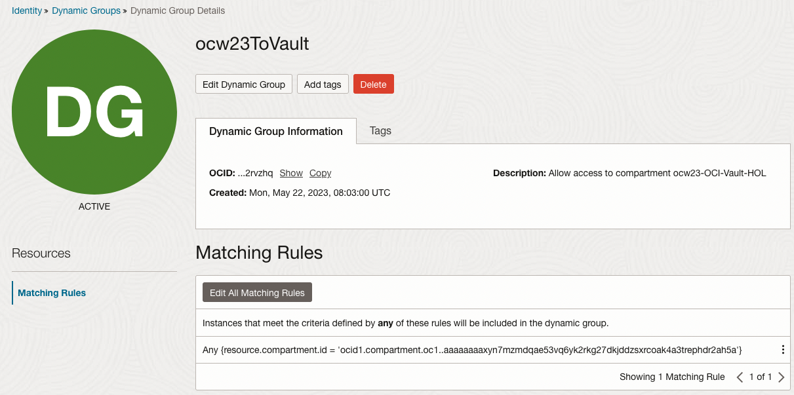
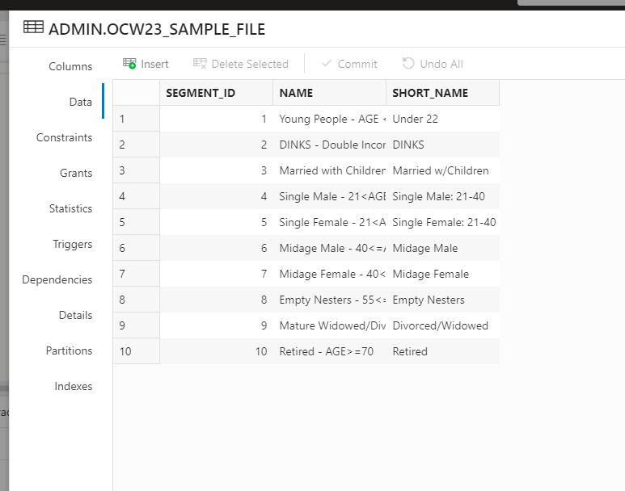

# Lab 3 - Configure OCI resources encryption with an externally managed key

## Introduction

This lab walks you through the creation of different OCI resources and the configuration of their encryption with the key you created externally to OCI in Thales CipherTrust Manager. 

You are your Company Data Manager. You will create a storage space as well as an Autonomous Database. You will select to encrypt those resources with the key you created in Thales CipherTrust Manager during the previous lab. You will upload data to those two resources and access it to make sure the encryption/decryption operations are working correctly. 

Estimated Lab Time: -- minutes

### Objectives

In this lab, you will:
* Connect to your OCI tenant and create an encrypted Storage Bucket and Autonomous Database.
* Test access to the encrypted data and confirm the right users can correctly access cleartext data in the Storage Bucket and Autonomous Database.

### Prerequisites

This lab assumes you have:
* An Oracle Cloud account
* All previous labs successfully completed

## Task 1: Create a bucket with your own encryption keys

1. You first need to login to your OCI tenant with the **Data\_Manager\_XXX** user where XXX is your student login, please refer to the "Get Started" Lab if required. 
Let's first create a bucket in OCI Object Storage. To do that, log in to OCI console and navigate through the main hamburger menu to *"Storage > Object Storage > Buckets"*.
 
    

2. Create a bucket in the compartment "ocw23-OCI-Vault-HOL" by selecting the compartment on the left in the dropdown list, then by clicking the **Create Bucket** button.
    
    


3. Name it by following this naming convention: 
* **"ocw23-OCI-bucket-XXX"** where "XXX" is your student number. 

Select the option **Encrypt using customer-managed keys**. Once you select that option, new fields to be filled will appear.
* Select the Vault you created in lab 1 called "ocw23-OCI-Vault-XXX" where "XXX" is your student number. 
* Select the encryption key that you created in Thales CTM, called "ocw23-AES-256-XXX" where "XXX" is your student number.

Then click **Create**.
    

4. Congratulations, you have now created a new storage bucket in OCI where all the data you upload will be automatically encrypted at all times with the encryption key you created on Thales CTM:

  

## Task 2: Upload data into the bucket and check visibility

You will upload a file that will be provided to you into the bucket you recently created in Object Storage.

1. Donwload the file [ocw23-sample-file.csv](https://objectstorage.eu-frankfurt-1.oraclecloud.com/p/4B-I7ermCb2D5OfuLn9XyvSCaEI9knzz35jIcQEnkinsuFOfg94HtJnuimhWjISj/n/frnj6sfkc1ep/b/ocw23-resources/o/ocw23-sample-file.csv)

2. Click in your recently created bucket and click **Upload** in the section **Objects**:

  

3. Leave the Object prefix name blank and select the file you downloaded. Click **Upload**:

   

4. Close the window, and now you can see your file uploaded into your bucket under section **Objects**:

  

5. Now you will create a pre-authenticated request to be able to access the file in a specified time. You could share as well this URL with others. To do that, click to **Pre-Authenticated Requests** in the menu Resources in the left:

  

6. Click **Create Pre-Authenticated Request**:

  

7. Fill the parameters as follow 
* Name: enter "ocw23-sample-file"
* Pre-Authenticated Request target: Click on the "Object" tile
* Object Name: enter "ocw23-sample-file.csv"
* Access Type: select "Permit object reads"
* Expiration: leave the default or choose any time. 

 Then click **Create Pre-Authenticated Request**:
  

8. A window will prompt with the URL of the pre-authenticated request. Copy this URL and save it locally, you will need it later in lab 4. Click **Close**.

  

9. To check you have visibility into the file in your bucket, open another browser and go to the URL you copied previoulsy. The file should be automatically downloaded and you will be able to open it with Microsoft Excel and look at the content : it's decrypted. A job well done!

## Task 3: Create an Autonomous Database with your own encryption keys

Let's create now the Autonomous Database, and configure it with the key you created in Thales CTM. 

### Learn More

* In order to use customer-managed encryption for Autonomous Database, it is required to create permissions to allow your Autonomous Database to communicate with the OCI Vault service. For the purpose of this lab, we have pre-configured a Dynamic Group and the associated policy. For you to understand all the steps, you can look at the configuration below, or if you don't have time you can skip directly to step 1 of this lab. 

* We have created a dynamic group which automatically contains all the resources of this compartment. To see the configuration, in the Oracle Cloud Infrastructure console click *"Identity & Security"* and under *"Identity"*, click *"Dynamic Groups"*. 

 

* Look for a group called "ocw23ToVault" and click on its name to see all the details. 

 

* In the details panel, you can see the rule which was created: 
  ```
  resource.compartment.id = '<your_Compartment_OCID>'
  ```
  where &lt;your\_Compartment\_OCID&gt; is the OCID of the compartment ocw23-OCI-Vault-HOL.
  This means that any new resource created in the "ocw23-OCI-Vault-HOL" compartment will automatically belong to this group. This is a best practice for simplification as all the new Autonomous Database created will be part of it and benefit from the associated policy. Indeed when you are creating the dynamic group, the OCID for the new database is not yet available.

 

* Then we needed to write a policy statement for the dynamic group to enable access to OCI Vault resources: Vaults and Keys. To check the policy written for this lab, in the OCI console click *"Identity & Security"* and under *"Identity"*, click *"Policies"*:

  


* Look for a policy called "ocw23-Dynamic-Access-to-Vault-Policy" and click on its name to see all the details.

  

  * In the details panel, you can see a policy was written as follows:
  ```
  Allow dynamic-group ocw23ToVault to use vaults in compartment ocw23-OCI-Vault-HOL
  Allow dynamic-group ocw23ToVault to use keys in compartment ocw23-OCI-Vault-HOL
  ```

   

This policy configuration is very important. By default, no services can access Vaults and Keys. It is your responsibility as a CISO / Security Administrator of OCI to decide who/what can access which vaults and which encryption keys. This allows you to define a very advanced and granular encryption architecture within OCI, while leveraging your existing KMS/HSM assets on-premise as the key we are using in this lab has been created by you on your company existing Thales CTM tenant, outside of OCI. 

1. Now you can create the Autonomous Database. Navigate through the main hamburger menu to: *"Oracle Database > Autonomous Database"*.

    


2.	Click Create Autonomous Database:

    


3.	Fill the parameters as follows:
    * Compartment: ocw23-OCI-Vault-HOL
    *	Display Name: ocw23-OCI-adb-001
    *	Database Name: ocw23OCIadb001
    *	Workload type: Transaction Processing
    *	Deployment type: Shared Infrastructure
    *	Configure the database: &lt;Leave it as default&gt; 
    *	Administrator credentials: &lt;your ADMIN password&gt; 
    *	Network access: Secure access from everywhere
    *	License type: Bring Your Own License (BYOL)
    * Oracle Database Edition: Oracle Database Standard Edition (SE)
  
Click the link *"Show advanced options"*. A new section for Encryption Key will appear. Select the option: *"Encrypt using a customer-managed key in this tenancy"* and enter your previously created Vault and Master Encryption Key.


4. Click **Create Autonomous Database**. Then wait until the database status is set to green and ACTIVE.

  

## Task 4: Upload data into the Autonomous Database and check visibility

In this task you will load the previous CSV file you loaded into your bucket, into your previously created Autonomous Database.

1. Navigate to your Autonomous Database page in OCI console and go to the Database Actions Launchpad:

  

2. Once there, click to SQL under Development:

  

3. Web SQL Development UI is open and now you can load data into your database by clicking to **Data Load** on the top corner right:

  

4. Drag and drop the file into the prompted window and click the button **Run all**, which is shown as the green button icon on the top-left corner:

  

5. When the upload is complete, you will be able to see the state **Uploaded** next to the file. Click **Close**:

   

6. Refresh the browser and you will be able to see the new created table:

  

7. In order to see the data into the table, right click to the table and click **Open**:

  

8. In the new window, click the tab Data:

  

Congratulations, you have encrypted your file in Object Storage and your data within Autonomous Database. Now you will see in the next labs the simulation of an emergency due to a potential security breach. We will see together how you can protect your data in such a scenario!

## Learn More

* [OCI Autonomous Database](https://www.oracle.com/autonomous-database/)
* [Managing Encryption Keys on Autonomous Database](https://docs.public.oneportal.content.oci.oraclecloud.com/en-us/iaas/autonomous-database-shared/doc/autonomous-encrypt-set-rotate-keys.html)
* [Overview of OCI Object Storage](https://docs.oracle.com/en-us/iaas/Content/Object/Concepts/objectstorageoverview.htm)
* [Using OCI Object Storage bucket encryption](https://blogs.oracle.com/cloud-infrastructure/post/using-oci-object-storage-bucket-encryption)

## Acknowledgements
* **Authors** - Damien Rilliard (OCI Security Senior Director), Sonia Yuste (OCI Security Specialist)
* **Last Updated By/Date** - Sonia Yuste, June 2023