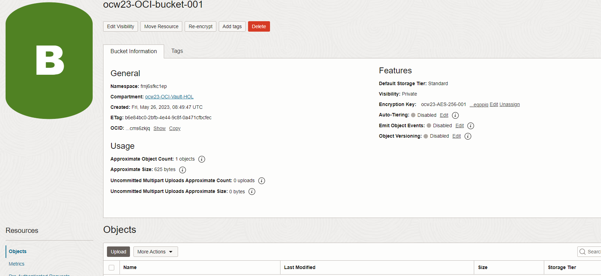
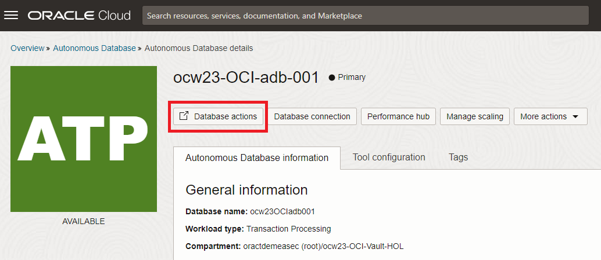
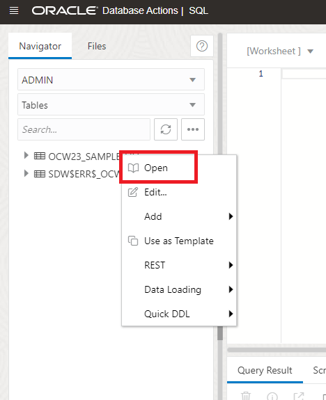
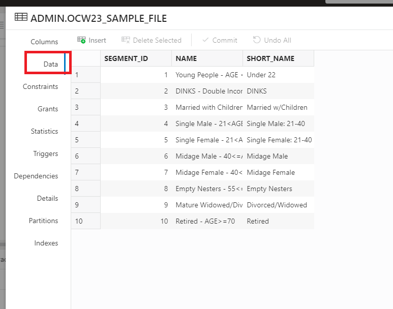

# Lab 5 - Emergency simulation test: re-enable data access

## Introduction

*Describe the lab in one or two sentences, for example:* This lab walks you through the steps to ...

Estimated Lab Time: -- minutes

### About <Product/Technology> (Optional)
Enter background information here about the technology/feature or product used in this lab - no need to repeat what you covered in the introduction. Keep this section fairly concise. If you find yourself needing more than two sections/paragraphs, please utilize the "Learn More" section.

### Objectives

*List objectives for this lab using the format below*

In this lab, you will:
* Simulate an emergency situation where you as a customer want to block access to your data in OCI
* Disable encryption key from the external CipherTrust Key management console
* Test access to the encrypted data and confirm users cannot access data in the Storage Bucket and Autonomous Database anymore
* Re-enable proper access once the alert is over

### Prerequisites (Optional)

*List the prerequisites for this lab using the format below. Fill in whatever knowledge, accounts, etc. is necessary to complete the lab. Do NOT list each previous lab as a prerequisite.*

This lab assumes you have:
* An Oracle Cloud account
* All previous labs successfully completed

## Task 1: Re-enable key in CipherTrust Manager

1. Go back to the CipherTrust Manager console. If you closed it, use the following URL to access CipherTrust Manager as a Service: *"https://us1.ciphertrust.dpondemand.io/?tenant=oracle-OracleCTM"* and append your student number. For example, if your student number is 001, go to the following URL: *"https://us1.ciphertrust.dpondemand.io/?tenant=oracle-OracleCTM001"*

  

  Enter the credentials you have been provided with. You are now logged into the CipherTrust Manager web console. Click on the Cloud Key Manager icon:

  

2. On the left pane, click **Cloud Keys > Oracle**.

  

3. Click on the three points on the right of your key line and select **Enable**:

  

4. A new window will prompt you to confirm. Click **Enable**:

  

6. Click **Refresh All**: 

  

  a new window will prompt you again to confirm. Click **Refresh All** again:

  

7. Wait until keys are in "Enabled" state:

  

## Task 2: Confirm data access into your bucket is possible as a result

1. Log in to OCI cloud tenant as Data\_Manager\_XXX, where "XXX" is your student number (please go to lab TODO to see how to log in to OCI), and navigate through the main hamburger menu to *"Storage > Object Storage > Buckets"*.
    
    

2. As you can see, the bucket you created with an external key is accessible again: 

   

  If you click on your bucket, you will be able to access:

   

  and ocw23-resources bucket is still accessible because it has been configured with Oracle-managed keys by design. That is a best practice customers can use when they do not want to manage the keys and key lifecycle for resources that do not contain any sensitive data. This way, OCI enables companies to have a very granular and powerfull key management solution for all of their OCI resources. 

3. Now we will check that the pre-authenticated request (PAR) that you have created is functional again as the key is enabled.
  Copy the URL you saved in lab 3 task 2 and paste it in your browser again. Confirm you can download the document. 
  Thus we have now confirmed that re-enabling the key from the external CipherTrust Manager instance brings back a fully functional behavior to OCI storage bucket.

## Task 3: Check data access into your Autonomous Database

1. Navigate through the main hamburger menu to: *"Oracle Database > Autonomous Database"*.

  

2. As you can see, the database is still stopped as the key was disabled: 

  

3. Now you will try to start the database because the key is enabled again: start again the database by clicking on **More Actions** and **Start**:

  

  Once you click **Start**, you will see the database is starting:

  
  
  Wait until the database is started:
  
  

  As you can see, now it is possible to start the database as the key is re-enabled and reachable by the autonomous database. 

4. In order to ensure the data can be decrypted, let's try to access the data within the database. In order to do that, go to the Database Actions Launchpad:

  

5. Once there, click to SQL under Development:

  

6. Web SQL Development UI is open and now you can see the data into the table, right click to the table and click **Open**:

  

7. In the new window, click the tab Data:

  

  As you can see, now you have again complete visibility on the data within the database, as the key was re-enabled.

Congratulations, you have completed all the labs!!

## Learn More

* [Using Your Own Keys in Vault for Server-Sode Encryption](https://docs.oracle.com/en-us/iaas/Content/Object/Tasks/encryption.htm#UsingYourKMSKeys)
* [Managing Encryption Keys on Autonomous Database](https://docs.oracle.com/en/cloud/paas/autonomous-database/adbsa/autonomous-encrypt-set-rotate-keys.html#GUID-0795135D-B057-4DBC-92C9-368AF4C82D0A)

## Acknowledgements
* **Authors** - Damien Rilliard (OCI Security Seno#ior Director), Sonia Yuste (OCI Security Specialist)
* **Last Updated By/Date** - Sonia Yuste, June 2023
