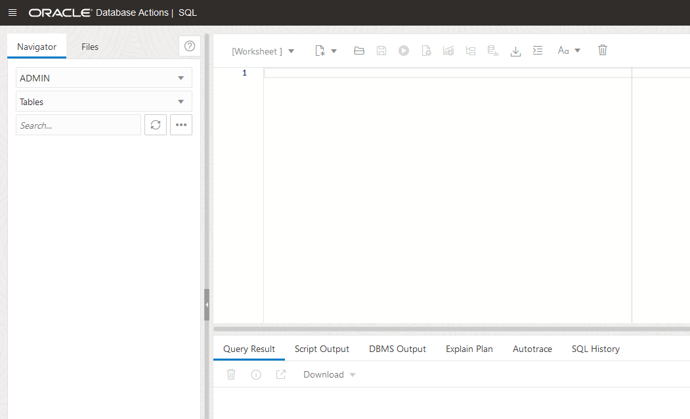

# Lab 5 - Emergency simulation test: blocking data access

## Introduction

*Describe the lab in one or two sentences, for example:* This lab walks you through the steps to ...

Estimated Lab Time: -- minutes

### About <Product/Technology> (Optional)
Enter background information here about the technology/feature or product used in this lab - no need to repeat what you covered in the introduction. Keep this section fairly concise. If you find yourself needing more than two sections/paragraphs, please utilize the "Learn More" section.

### Objectives

*List objectives for this lab using the format below*

In this lab, you will:
* Simulate an emergency situation where you as a customer want to block access to your data in OCI
* Remove encryption key from the external CipherTrust Key management console
* Test access to the encrypted data and confirm users cannot access cleartext data in the Storage Bucket and Autonomous Database anymore

### Prerequisites (Optional)

*List the prerequisites for this lab using the format below. Fill in whatever knowledge, accounts, etc. is necessary to complete the lab. Do NOT list each previous lab as a prerequisite.*

This lab assumes you have:
* An Oracle Cloud account
* All previous labs successfully completed


## Task 1: Load data in Autonomous Database and bucket in Object Storage

In this task you will load data in your previously created Autonomous Database and also in your bucket.

1. Create a table with data in your Autonomous Database by accessing the Web SQL Developer. In order to do that, go to your Autonomous Database and click on Database Actions:

	

2. Log in with ADMIN user and the password you provided during database creation.

  

3. Click on SQL box, under Development section.

  

4. Web SQL Developer will launch, and you will be able to run SQL queries to create users and tables.

  

5. Create now a table to store test data by running the following script in web SQL Developer:

  ```
  CREATE TABLE ADMIN.NEWDATA
(   STATUS VARCHAR2(50 BYTE) COLLATE "USING_NLS_COMP",
    SERVICE VARCHAR2(255 BYTE) not null,
    EXTRACT_DATE DATE not null
)   DEFAULT COLLATION "USING_NLS_COMP";
  ```

## Task 2: Concise Task Description

1. Step 1 - tables sample

  Use tables sparingly:

  | Column 1 | Column 2 | Column 3 |
  | --- | --- | --- |
  | 1 | Some text or a link | More text  |
  | 2 |Some text or a link | More text |
  | 3 | Some text or a link | More text |

2. You can also include bulleted lists - make sure to indent 4 spaces:

    - List item 1
    - List item 2

3. Code examples

    ```
    Adding code examples
  	Indentation is important for the code example to appear inside the step
    Multiple lines of code
  	<copy>Enclose the text you want to copy in <copy></copy>.</copy>
    ```

4. Code examples that include variables

	```
  <copy>ssh -i <ssh-key-file></copy>
  ```

## Learn More

*(optional - include links to docs, white papers, blogs, etc)*

* [URL text 1](http://docs.oracle.com)
* [URL text 2](http://docs.oracle.com)

## Acknowledgements
* **Author** - <Name, Title, Group>
* **Contributors** -  <Name, Group> -- optional
* **Last Updated By/Date** - <Name, Month Year>
