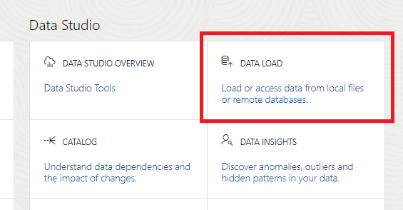
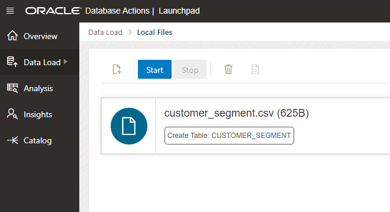
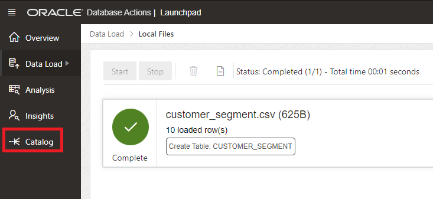
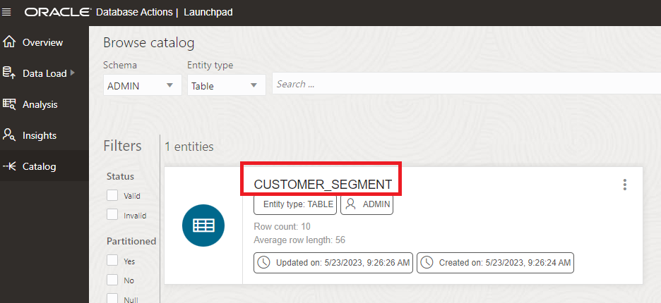

# Lab 5 - Emergency simulation test: blocking data access

## Introduction

*Describe the lab in one or two sentences, for example:* This lab walks you through the steps to ...

Estimated Lab Time: -- minutes

### About <Product/Technology> (Optional)
Enter background information here about the technology/feature or product used in this lab - no need to repeat what you covered in the introduction. Keep this section fairly concise. If you find yourself needing more than two sections/paragraphs, please utilize the "Learn More" section.

### Objectives

*List objectives for this lab using the format below*

In this lab, you will:
* Simulate an emergency situation where you as a customer want to block access to your data in OCI
* Remove encryption key from the external CipherTrust Key management console
* Test access to the encrypted data and confirm users cannot access cleartext data in the Storage Bucket and Autonomous Database anymore

### Prerequisites (Optional)

*List the prerequisites for this lab using the format below. Fill in whatever knowledge, accounts, etc. is necessary to complete the lab. Do NOT list each previous lab as a prerequisite.*

This lab assumes you have:
* An Oracle Cloud account
* All previous labs successfully completed

## Task 1: Load sample data into your Autonomous Database 

In this task you will load data into your previously created Autonomous Database and also in your bucket.

1. Right-click on the link below and click **Save Link As…** to download the file to your computer.

	TODO: link

2. Navigate to your Autonomous Database page in OCI console and go to the Data Load main page by going to the Database Actions Launchpad and in the **Data Studio** section, click **DATA LOAD.**

  

  

3. Leave the default selections, **LOAD DATA** and **LOCAL FILE**, and click Next.

  

4. The Local Files page enables you to drag and drop files to upload, or you can select files. Drag the customer_segment.csv file from the directory where you downloaded onto the Drag and Drop target. Or select the files using the Select Files pop-up dialog.

  

5. When the upload is complete, you simply click the blue **Start** button and click **Run** to run the data load job.

6. When the load job finishes, a green check mark appears for each table. Click **Catalog** in the menu on the left.

  

7. The Catalog shows the CUSTOMER_SEGMENT table has been successfully created. You can click the table name to see the data.

  

This completes the lab on loading CSV files from your local computer.

## Task 2: Load sample data into your bucket

## Task 3: Disable connection to Thales CipherTrust Manager
 
## Learn More

*(optional - include links to docs, white papers, blogs, etc)*

* [URL text 1](http://docs.oracle.com)
* [URL text 2](http://docs.oracle.com)

## Acknowledgements
* **Author** - <Name, Title, Group>
* **Contributors** -  <Name, Group> -- optional
* **Last Updated By/Date** - <Name, Month Year>
